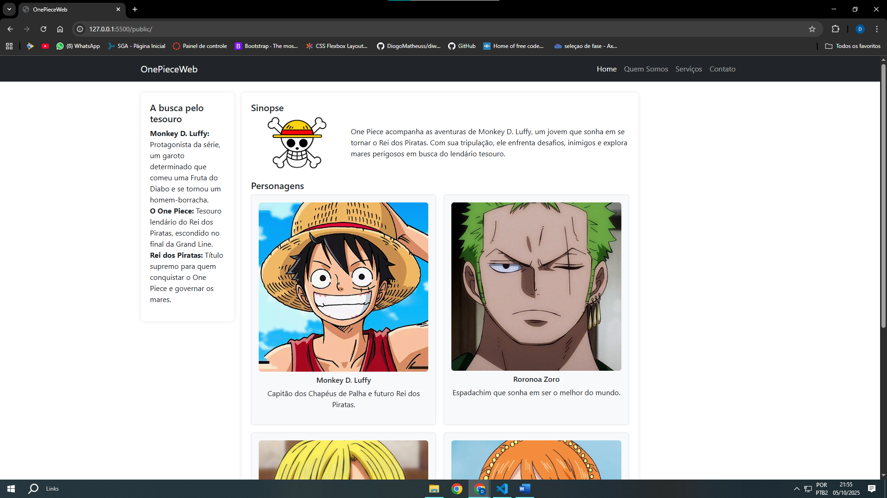
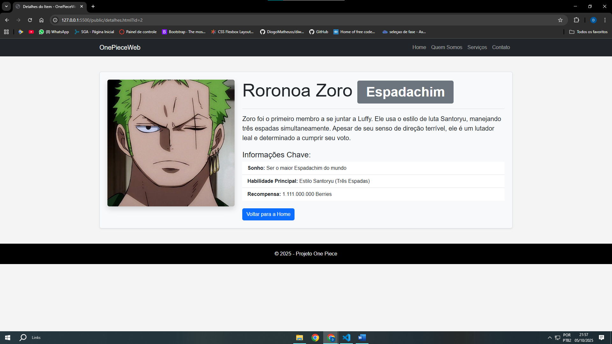

[](https://classroom.github.com/online_ide?assignment_repo_id=20902517&assignment_repo_type=AssignmentRepo)
# Trabalho Prático 05 - Semanas 7 e 8

**Páginas de detalhes dinâmicas**

Nessa etapa, vamos evoluir o trabalho anterior, acrescentando a página de detalhes, conforme o  projeto escolhido. Imagine que a página principal (home-page) mostre um visão dos vários itens que existem no seu site. Ao clicar em um item, você é direcionado pra a página de detalhes. A página de detalhe vai mostrar todas as informações sobre o item do seu projeto. seja esse item uma notícia, filme, receita, lugar turístico ou evento.

Leia o enunciado completo no Canvas. 

**IMPORTANTE:** Assim como informado anteriormente, capriche na etapa pois você vai precisar dessa parte para as próximas semanas. 

**IMPORTANTE:** Você deve trabalhar e alterar apenas arquivos dentro da pasta **`public`,** mantendo os arquivos **`index.html`**, **`styles.css`** e **`app.js`** com estes nomes, conforme enunciado. Deixe todos os demais arquivos e pastas desse repositório inalterados. **PRESTE MUITA ATENÇÃO NISSO.**

## Informações Gerais

- Nome: Diogo Matheus
- Matricula:903817
- Proposta de projeto escolhida:Temas e Conteúdos Associados
- Breve descrição sobre seu projeto:One piece q é um anime/manga e seus personagens


## Print da Home-Page



## Print da página de detalhes do item



## Cole aqui abaixo a estrutura JSON utilizada no app.js

```javascript
const personagens = [
    {
        "id": 1,
        "nome": "Monkey D. Luffy",
        "funcao": "Capitão",
        "sonho": "Se tornar o Rei dos Piratas",
        "habilidade": "Fruta Gomu Gomu no Mi (Homem-Borracha)",
        "recompensa": "3.000.000.000 Berries",
        "imagem": "luffy.png",
        "descricao_curta": "Capitão dos Chapéus de Palha e futuro Rei dos Piratas.",
        "descricao_completa": "Luffy é o protagonista da série, conhecido por sua personalidade alegre e seu desejo inabalável de liberdade. Comeu a Fruta do Diabo Gomu Gomu no Mi, transformando seu corpo em borracha. Sua busca pelo One Piece é a força motriz da história."
    },
    {
        "id": 2,
        "nome": "Roronoa Zoro",
        "funcao": "Espadachim",
        "sonho": "Ser o maior Espadachim do mundo",
        "habilidade": "Estilo Santoryu (Três Espadas)",
        "recompensa": "1.111.000.000 Berries",
        "imagem": "zoro.jpg",
        "descricao_curta": "Espadachim que sonha em ser o melhor do mundo.",
        "descricao_completa": "Zoro foi o primeiro membro a se juntar a Luffy. Ele usa o estilo de luta Santoryu, manejando três espadas simultaneamente. Apesar de seu senso de direção terrível, ele é um lutador leal e determinado a cumprir seu voto."
    },
    {
        "id": 3,
        "nome": "Sanji",
        "funcao": "Cozinheiro",
        "sonho": "Encontrar o All Blue",
        "habilidade": "Estilo de luta com as pernas (Black Leg)",
        "recompensa": "1.032.000.000 Berries",
        "imagem": "sanji.jpg",
        "descricao_curta": "Cozinheiro que busca o mar lendário All Blue.",
        "descricao_completa": "Sanji é o cozinheiro da tripulação, com uma regra de nunca usar as mãos para lutar, protegendo-as para cozinhar. Seu sonho é encontrar o All Blue, um mar lendário onde peixes de todos os oceanos se reúnem."
    },
    {
        "id": 4,
        "nome": "Nami",
        "funcao": "Navegadora/Cartógrafa",
        "sonho": "Mapear o mundo inteiro",
        "habilidade": "Controle climático (Clima-Tact)",
        "recompensa": "366.000.000 Berries",
        "imagem": "nami.jpg",
        "descricao_curta": "Cartógrafa que deseja mapear o mundo inteiro.",
        "descricao_completa": "Nami é a navegadora e cartógrafa da tripulação. Possui uma habilidade incrível para prever o clima e é responsável pela navegação precisa nos mares perigosos. Seu objetivo é desenhar um mapa completo de todo o mundo."
    }
];